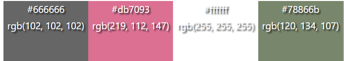

# Blossoming Bouquets

## Table of contents
* [UX](#ux)
    * [Strategy](#strategy)
        * [Project overview](#project-overview)
        * [Project goals](#project-goals)
    * [Scope](#scope)
        * [Consistent features implemented](#consistent-features-implemented)
        * [Unique features implemented](#unique-features-implemented)
        * [Features left to implement](#features-left-to-implement)
    * [Structure](#structure)
        * [Database model](#database-model)
        * [Applications](#applications)
    * [Skeleton](#skeleton)
        * [Wireframes](#wireframes)
    * [Surface](#surface)
        * [Colour scheme](#colour-scheme)
        * [Typography](#typography)
        * [Imagery](#imagery)
* [Testing](#testing)
    * [User story testing](#user-story-testing)
    * [Manual testing](#manual-testing)
    * [Automated testing](#automated-testing)
    * [Bugs and issues](#bugs-and-issues)
    * [Validator testing](#validator-testing)
* [Deployment](#deployment)
* [Credits](#credits)
    * [Technologies](#technologies)
    * [Resources](#resources)
    * [Content](#content)
    * [Media](#media)
    * [Acknowledgements](#acknowledgements)

# UX

## Strategy

### Project overview

This project is a ficticious flower shop site selling flower bouquets and baskets for occasions such as birthdays and weddings. Clients are able to view bouquets, add them to a basket, review their basket and make a purchase. The customer is also given the chance to create an account where they would be able to perform the same actions as above but will also be able to view their past orders. 

### Project goals

Below is a spreadsheet of epics for this project which have been broken down into user stories. The implementation of these user stories have been planned and managed through the Github Kanban board tool. See the following link to the .

## Scope

### Consistent features implemented

There are a few features that have been purposely designed to look the same, to allow users to gain familiarity with the site layout and enable them to find information quickly. 

### Unique features implemented

### Features left to implement

Refer to the future improvements of [user story testing](#user-story-testing)

## Structure 

### Database model

Below is a link to the ERD created for this project.

### Applications

In this project, xxxx applications (apps) have been created; 

## Skeleton

### Wireframes

Below are links to the initial wireframes created for this project. During development, plans were slightly modified in order to improve the user experience. 

* [Home page](readme_documents/wireframes/home-page-wireframe.png)
* [Bouquets page](readme_documents/wireframes/bouquets-page-wireframe.png)
* [Blog page](readme_documents/wireframes/blog-page-wireframe.png)
* [Blog page expanded](readme_documents/wireframes/blog-expanded-page-wireframe.png)
* [Contact us page](readme_documents/wireframes/contact-us-page-wireframe.png)
* [Sign up page](readme_documents/wireframes/signup-page-wireframe.png)
* [Login page](readme_documents/wireframes/login-page-wireframe.png)
* [Basket page](readme_documents/wireframes/basket-page-wireframe.png)
* [Checkout page](readme_documents/wireframes/checkout-page-wireframe.png)

## Surface

### Colour scheme 

The colour scheme used in this site consist of colours; #666666 (grey), #db7093 (pink), #ffffff (white), #78866b (grey-green). These colours give a fresh yet minimalist look. 

### Typography 

There are two fonts used in this site which were sourced from [Google fonts](https://fonts.google.com/). Sacramento (cursive) has been used for the site logo and page headings and Montserrat (sans-serif) for the site body text. The combination of these two fonts give the site an elegant and minimalistic appearance.

| Image | Description |
| --- | --- |
|  | Logo and page heading font - Sacramento (cursive), Regular 400 |
|  | Body font - Montserrat (sans-serif), ExtraLight 200 |

### Imagery

The logo image has been created using a [Canva](https://www.canva.com/en_gb/) template. It was chosen to convey the purpose of the site; flower bouquets, in a minamalistic manner. The same image has been used to generate a favicon for the site, which was created using [Favicon.io](https://favicon.io/favicon-converter/)

The hero image and the bouquet images used for the site have been sourced from [Pexels](https://www.pexels.com/). 

The hero image was selected as it effectively portrays to the user the intent of the site and fits in well with the site colour scheme. The bouquet images selected, have all have been taken on a dark grey background (other than wedding bouquet images) and in the same pose, which adds a level of consistency to the site. 

Images were compressed using [Tiny png](https://tinypng.com/) in order to improve site load times for better user experience. 

[Font awesome](https://fontawesome.com/) icons have been used for navigation links (account, shopping bag, search), social media links (email and facebook) and key button links (keep shopping, checkout and view bag)

## Testing 

### User story testing 

Tests were performed to determine whether the user story acceptance criteria were met by the site development. 

### Manual testing 

Manual testing of interactive features was carried out, see tests and results of testing below:

### Automated testing 

Automated testing of the service model was also carried out using Django TestCase to test the service views, forms and model. 

### Responsive testing

The site works well on small, medium and larger screens. See below links to the responsive views on different screens. 

The features that respond to different screen sizes include:

### Bugs and issues

### Validator testing

W3 HTML Validator checks were carried out on all viewable site pages. Main errors and warnings have been reported below as well as resolutions. Once all page errors and warnings were addressed, validator checks were re-run and no further errors appeared on any page.

| Error | Resolution |
| --- | --- |
|  | Home page - Renamed "Any occasion" category to "Occasional" |
|  | Various pages - Removed "type" from script tag |
|  | Add bouquet page, toast success page - Removed strong tag and added Bootstrap 4 class "font-weight-bold" to perform a similar function |
|   | Add bouquet page - This error occured because on the custom_clearable_file_input.html page there is an input field with an id but the django forms include also has an id. Removed the input id tag and re-tested the page - no issues |
|  | Edit bouquet page - Added "alt" attribute to image tag for bouquet images |
|  | Blog page - four errors resulted due to two open "a" tags for an image. Resolved by changing one open "a" tag to a closed "a" tag |
|  | Bag page - table "scope" used twice in the same bag details table. Removed unrequired scope to define subtotal/delivery/checkout row |
|  | Bag page - defined 4 columns at the beginning of the bag details table then further down set colspan to 12 for the subtotal/delivery/checkout row. Reset colspan from 12 to 4. |
|  | Checkout page - A label tag was present for an element that did not have an input field hence did not require a "for" attribute. Changed label element to a div element as label not required. |
|  | Checkout page - the checkout complete loading spinner was kept inside an empty "h1" tag. Replaced "h1" tag with a "div" tag. |
|  | Checkout success page - A stray "div" end tag found - tag removed as not required. |

CSS W3 Validator checks were carried out on the style.css file - no errors found.

PEP8 checks were carried out on all python files. As the PEP8 online site is currently down, in order to validate pyton code, "pycodestyle" was used inside the gitpod workspace.This was used by pressing Ctrl+Shift+P inside the workspace, then "linter" was selected from the search bar, followed by "Python: Select Linter". All error messages were addressed - besides ones list below, which were not addressed due to possible resulting effects on project functionality.

| Error | Resolution |
| --- | --- |
|  | settings.py - long line errors were not addressed as may effect project functionality. Upon reviewing comments from other students on Code Institute slack - to prevent any errors displaying, the comment "#  noqa" (no quality assurance) was used. |
|  | webhooks.py - long line error was not addressed as may effect project functionality. Upon reviewing comments from other students on Code Institute slack - to prevent any errors displaying, the comment "#  noqa" (no quality assurance) was used. |

Lighthouse testing also carried out to review site performance and useability, the results of these tests can be found below.

## Deployment 

A thorough walkthrough of the deployment steps taken for this project can be viewed in the below document. 

* [Deployment procedure](readme_documents/deployment/deployment_procedure.pdf)

## Credits

### Technologies 

The languages used for this project are: 

- HTML 
- CSS
- Javacript
- Python 

The key frameworks, libraries, databases and programs used for this project are:

- [Django](https://www.djangoproject.com/) - used as the python framework 
- [Bootstrap version 4.6.2](https://getbootstrap.com/) - used for project styling and social media icons
- [Google fonts](https://fonts.google.com/) - used to select project fonts
- [Heroku Postgres](https://www.heroku.com/postgres) - used as the database after project was deployed and in production
- [SQlite](https://www.sqlite.org/index.html) - used as the database before deployment to Heroku postgres and to perform unitests 
- [Github](https://github.com/) - used for version control and project storage
- [Gitpod](https://www.gitpod.io/blog/gitpod-launch) - used as the source code editor
- [Heroku](https://www.heroku.com/) - used as the cloud based deployment platform
- [Stripe](https://stripe.com/gb/payments) - used to handle secure payments
- [Amazon Web Services S3](https://aws.amazon.com/free/?trk=d5254134-67ca-4a35-91cc-77868c97eedd&sc_channel=ps&s_kwcid=AL!4422!3!433803620861!e!!g!!amazon%20web%20services&ef_id=EAIaIQobChMIn-XCldTH-gIVsmDmCh004gB-EAAYASAAEgKK-fD_BwE:G:s&s_kwcid=AL!4422!3!433803620861!e!!g!!amazon%20web%20services) - used for cloud based storage of static and media files
- [Lucidchart](https://www.lucidchart.com/pages/landing?utm_source=google&utm_medium=cpc&utm_campaign=_chart_en_tier1_mixed_search_brand_exact_&km_CPC_CampaignId=1490375427&km_CPC_AdGroupID=55688909257&km_CPC_Keyword=lucid%20chart&km_CPC_MatchType=e&km_CPC_ExtensionID=&km_CPC_Network=g&km_CPC_AdPosition=&km_CPC_Creative=442433236001&km_CPC_TargetID=kwd-55720648523&km_CPC_Country=9045963&km_CPC_Device=c&km_CPC_placement=&km_CPC_target=&gclid=Cj0KCQjwyYKUBhDJARIsAMj9lkGuAWT49rmauAUKPE1dZc32REnshWbCY-h0UoYogZ4mtAhFjn8IypsaAoYNEALw_wcB) - used to create the Entity Relationship Diagram (ERD)
- [Favicon.io](https://favicon.io/favicon-generator/) - used to generate favicon
- [Balsamiq](https://balsamiq.com/wireframes/?gclid=CjwKCAjw9-KTBhBcEiwAr19igzgSMCAHTuTIsTpGrtk-KZPATPmc7R0M9oo0VUs2jhgbGpmXmCnKSxoCstwQAvD_BwE) - used to create the wireframes
- [Tiny png](https://tinypng.com/) - used to compress images.
- [Color-hex](https://www.color-hex.com/user/add-palette.php) - used to create a colour palette
- [PEP8 online](http://pep8online.com/) - used to check python code
- [amiresponsive](https://ui.dev/amiresponsive) - used to generate responsive images of the site
- [W3C Mark up Validation Service](https://validator.w3.org/) - used to validate html templates
- [W3 CSS Validation Service](https://jigsaw.w3.org/css-validator/) - used to validate CSS stylesheet

### Resources

The following sites were used to assist in this project:

* [Stackoverflow](https://stackoverflow.com/) - used to resolve troubleshooting issues
* [Codeinstitute](https://codeinstitute.net/full-stack-software-development-diploma/?utm_term=code%20institute&utm_campaign=CI+-+UK+-+Search+-+Brand&utm_source=adwords&utm_medium=ppc&hsa_acc=8983321581&hsa_cam=1578649861&hsa_grp=62188641240&hsa_ad=581730217381&hsa_src=g&hsa_tgt=kwd-319867646331&hsa_kw=code%20institute&hsa_mt=e&hsa_net=adwords&hsa_ver=3&gclid=CjwKCAjwnZaVBhA6EiwAVVyv9F19a0Iyt9WIs12IIQEoad7khrICogE2M6ZFmKsMf-MpkNxtU55HGxoCE1QQAvD_BwE)  - how to set up and run an ecommerce site
* [Coder-coder](https://coder-coder.com/) - how to add darker overlay to background image
* [System 22](https://www.youtube.com/watch?v=LV3w60037EI) - how to add nav link underline hover effect
* [Devpractical.com](https://devpractical.com/bootstrap-sticky-footer/#:~:text=To%20make%20your%20footer%20stick,100%20to%20tag.) - how to make footer stick to bottom of the page

### Content

The following sites were used to obtain information about flower shops:

* [Bunches](https://www.bunches.co.uk)
* [Blossoming gifts](https://www.blossominggifts.com)

### Media 

All images for this project were taken from the below sites:

* Logo - [Canva](https://www.canva.com/logos/)
* Hero image and bouquets - [Pexels](https://www.pexels.com/)
* Image coming soon - [Freepix](https://www.freepik.com)

### Acknowledgements

My heartfelt thanks extends to my husband for his continual support througout the entire course. I would like to offer my sincere thanks to my mentor Brian Macharia for all his time, advice and guidance throughout this project. My thanks also extends to the entire [Code Institute](https://codeinstitute.net/full-stack-software-development-diploma/?utm_term=code%20institute&utm_campaign=CI+-+UK+-+Search+-+Brand&utm_source=adwords&utm_medium=ppc&hsa_acc=8983321581&hsa_cam=1578649861&hsa_grp=62188641240&hsa_ad=581730217381&hsa_src=g&hsa_tgt=kwd-319867646331&hsa_kw=code%20institute&hsa_mt=e&hsa_net=adwords&hsa_ver=3&gclid=CjwKCAjw14uVBhBEEiwAaufYxzLItLILR2VKJH9mFRvzp_QbO7Gm2bbD9VZW_emQabtiDlH2qb665BoCvd0QAvD_BwE) Tutors who have been fantastic with helping out with troubleshooting issues. 

