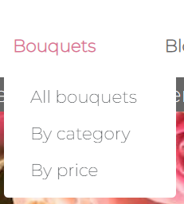
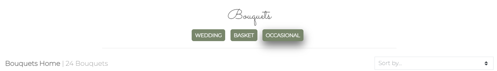
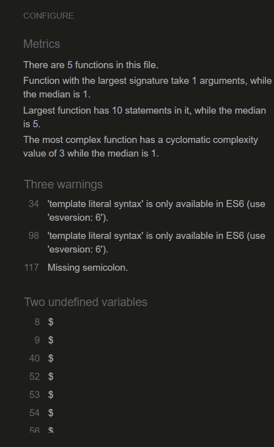
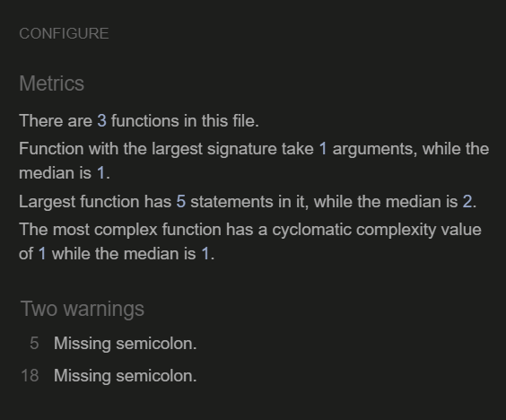
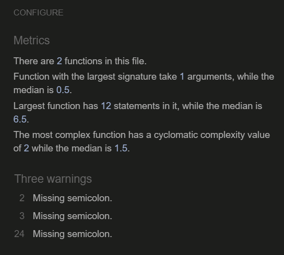

# Blossoming Bouquets

 

[Link to the deployed site](https://blossoming-bouquets.herokuapp.com/)

## Table of contents
* [UX](#ux)
    * [Strategy](#strategy)
        * [Project overview](#project-overview)
        * [Project goals](#project-goals)
    * [Scope](#scope)
        * [Consistent features implemented](#consistent-features-implemented)
        * [Unique features implemented](#unique-features-implemented)
        * [Features left to implement](#features-left-to-implement)
    * [Structure](#structure)
        * [Database model](#database-model)
        * [Applications](#applications)
    * [Skeleton](#skeleton)
        * [Wireframes](#wireframes)
    * [Surface](#surface)
        * [Colour scheme](#colour-scheme)
        * [Typography](#typography)
        * [Imagery](#imagery)
    * [Web marketing](#web-marketing)
        * [Search Engine Optimization](#search-engine-optimization)
        * [Social media marketing](#social-media-marketing)
        * [Email marketing](#email-marketing)
        * [Privacy policy](#privacy-policy)
* [Testing](#testing)
    * [User story testing](#user-story-testing)
    * [Manual testing](#manual-testing)
    * [Bugs and issues](#bugs-and-issues)
    * [Validator testing](#validator-testing)
* [Deployment](#deployment)
* [Credits](#credits)
    * [Technologies](#technologies)
    * [Resources](#resources)
    * [Content](#content)
    * [Media](#media)
    * [Acknowledgements](#acknowledgements)

# UX

## Strategy

### Project overview

This project is a ficticious flower shop site selling flower bouquets and baskets for occasions such as birthdays and weddings. Clients are able to view bouquets, add them to a basket, review their basket, make a purchase, make contact with the store as well as view blog posts. The customer is also given the chance to create an account with the store which would give them additional access to create an up to date profile to aid with quicker checkout and also allow them to comment on blog posts.

This site is an example of an e-commerce application as it faciliates business transactions. Specifically it is a Business to Customer (B2C) e-commerce application, as it is primarily aimed at customers and not businesses.

### Project goals

Attached is list of epics for this project which have been broken down into [user stories](readme_documents/user-stories/user-stories.pdf). The implementation of these user stories have been planned and managed through the Github Kanban board tool. See the following link to the [Blossoming Bouquets Kanban board](https://github.com/users/JPatel87/projects/3/views/1).

## Scope

### Consistent features implemented

There are a few features that have been purposely designed to look the same, to allow users to gain familiarity with the site layout and enable them to find information quickly. 

| Image | Description |
| --- | --- |
| Favicon and site tab (all screen sizes) | The site tab includes the site bouquet logo and the site name, in order to re-inforce the brand and build memory of it in the users mind. |
| Header - large screens and above (greater than 992px)  | 1) Responsive header on large screens and above (e.g laptops), consisting of the site logo, navigation menu, search bar and delivery banner. 2) Upon hover of any of the navigation items, the links/icons turn pink. 3) When the home, bouquets, blog and contact us page are active, the link is underlined. 4) The logo acts as a link to the home page. | 
| Header - medium screens (less than 992px)  | Responsive header on medium screens (e.g. tablets). Small screens (less than 768px e.g. mobile phones) is the same but without the logo image.| 
| Account dropdown menu - authorised user (all screen sizes) | 1) Account dropdown for unauthorised users only consist of the "register" and "login" dropdown items 2) For authorised users, the options change to "My profile" and "Logout". 3) Logged in status only appears on medium and above screens. 4) For superusers, there is one additional dropdown item, "Add bouquet". |
| Bouquet dropdown menu (all screen sizes)  | Bouquet dropdown menu, same for authorised and unauthorised users. | 
| Footer - medium screens and above  | Footer, is responsive on all screens. The Facebook link and privacy policy are vertically aligned at the bottom on small screens and below. |
| Page headings | All page headings are styled in the same way with font Sacramento, center aligned with a horizontal rule | 
| Buttons | 1) All desirable action buttons are coloured green, otherwise buttons are coloured grey 2) Both types of buttons have a grey shadow when hovered over, to add a subtle effect. | 
| Default image  | There is a non-required image field in the forms for adding/editing a bouquet/blog. If an image is not selected then a default "Image coming soon" image is displayed.| 
| Success messages | 1) All successful actions taken by users are relayed back to them through success messages appearing in the top right, with a green top border. 2) Examples include; logging in, editing a bouquet, blog or comment, adding a bouquet to bag, submitting a contact us query | 
| Alert messages | 1) All noteworthy actions that a user is about to take are relayed back to them through alert messages appearing in the top right, with a blue top border. 2) These are relayed when an appropriate user chooses to edit a bouquet, blog or comment. | 
| Error messages | 1) All instances where a form is not filled in correctly are relayed back to users through error messages appearing in the top right, with a red top border. 2) These messages direct the user back to the form where an error has been highlighted. | 
| Access to restricted areas  |1) All instances where a user tries to access a restricted access area by typing the url into the address bar, is relayed back to the user through error messages appearing in the top right, with a red top border. 2) These messages inform the user that they cannot view the page they attempted to and the reason why. 3) Examples include non-superusers trying to access add/edit/delete bouquets or blog post pages or one user trying to edit/delete another user's comment. | 
| Delete confirmation Delete message   | 1) All delete or logout links when clicked direct to a confirmation page, for good user experience, in case a user accidently selects delete or logout. 2) This applies to the following pages; delete bouquet, delete blog post, delete comment, logout page. 3) Once delete or logout is confirmed, a success message appears in the top right. | 

### Unique features implemented

| Image | Description |
| --- | --- |
| Home page   | Home page consists of only the hero image, slogan and a call to action button, to keep the site looking minimalistic. The page appears the same on all screen sizes.| 
| All bouquets page - heading (all screen sizes)  | 1) All bouquets page heading includes category links for easy access. These links have a grey shadow when hovered over. 2) There is a "Bouquets Home" link on the top left - this can be clicked to go back to the all bouquets page if on any other bouquets page. When it is hovered over it turns pink. 3) There is sort by filter box on the top right, if users want to filter bouquets by price, name and category.| 
| All bouquets page - content (large screens and above)  | 1) All bouquets page is responsive on all screen sizes. On medium and small screens 2 bouquets per row are displayed and on extra small screens 1 bouquet per row is displayed. 2) All bouquets have their image, name, price and category listed 3) Only superusers can see the "Edit/Delete" options below the bouquets. 4) There is a back to the top button on the bottom left, to improve user experience.| 
| Bouquet detail page - (medium screens and above)  | 1) Bouquet detail page is responsive on all screens; on small screens all content is aligned vertically; image on one row and content below. 2) Details consist of bouquet image, name, price, category, quantity selector and action buttons. 3) Quantity "minus" selector is greyed out when "1" is selected to prevent users entering a quantity below 1.| 
| Add Bouquet page (medium screens and above)  | 1) Bouquet add/edit page (both the same) are responsive on all screens. On small screens and below, the edit form spans 12 columns, whereas on medium and above it spans 6 columns. 2) Only superusers have access to add or edit a bouquet. 3) In order to prevent users from mis-entering an unrealistic price value, a min and max validator has been used - price ranges for bouquets should be between £15-£100 otherwise an error message will appear upon form submission.
| Add to bag success message (all screens)  | 1) When a bouquet is added to the bag, a success message displays the bag item quantity, the bouquet name and image and the total. 2) If the bag quantity is below the delivery threshold - the success message will flag this to the user in a yellow box in the same success message. |
| Bag page (all screen sizes)  Empty bag page (all screen sizes) | 1) The shopping bag has an image of the bouquet, price, quantity selector, totals and action buttons. 2) A delivery cost is automatically calculated based on the price of the bouquets in the bag; anything £30 and over does not incur a delivery charge. 3) User is given the chance to update quantities or remove items from the bag. 4) If the user chooses to remove all products, they are directed to a page which informs them that nothing remains in their bag and a action button is present for them to continue shopping. |
| Checkout page - (large screen sizes and above)  | 1) The checkout page has a form for the user to add their name, email, delivery and card details on the left hand side and the order summary is on the right hand side. 2) On medium and lower screens, the content vertically stacks; order summary first followed by the delivery and payment form. 3) A red statement appears below the card field to warn users of the amount the card will be charged. 
| Checkout complete loading screen (all screen sizes)  | Once the checkout form has been completed successfully, a spinner on a blue background loads to signify that the payment is being processed. |
| Order confirmation page (medium screens and above) | 1) Once the payment has gone through an order confirmation page loads as well as a success message. 2) The page is responsive on all pages - on smaller screens and below, the order confirmation details are center aligned rather than left to right. |
| Profile page (large screens and above) | 1) Authenticated users can update their default delivery address on the profile page. 2) Past orders can be viewed. 3) This page is responsive across all screens, on medium and lower screens the delivery form and order history stack vertically, with the delivery form first and order history at the bottom. |
| Blog page (medium screens and above)  | 1) Blog page is responsive on all screens; on extra small screens, the blog posts align vertically. 2) There is a "Read more" link that appears below each blog snippet which links to the blog post detail page. Clicking on the post image also links to the post detail page. 3) For superusers, an "Add post" button appears at the top and "Edit/Delete" links appear below each blog post.
| Add blog post page (medium screens and above)  | 1) Blog post add/edit page (both the same) is responsive on all screens; on small screens and below the edit form spans 12 columns, whereas on medium and above it spans 6 columns. 2)  Only superusers have access to add or edit a blog post.|
| Blog post detail page (all screen sizes)  | 1) Blog post detail page states the author the post was published by, the date it was published, the post image followed by the body text. 2) There are also "Edit/Delete" links on this page in addition to the blog home page for superusers to perform these actions.|
| Blog post detail page > comments section (all screen sizes)  | 1) Only authorised users can make a comment, if users are not authorised they do not see the "Post comment" form and are requested to login. 2) To make a comment the user must add the name of the commenter and their comment (username of user is not added by default in case users want to remain anonymous). 3) Once the comment is made the name, date and comment displays on that particular blog detail page. 4) Comments are displayed with the oldest appearing at the top. 5) The user can "Edit/Delete" their own comment. 6) Any time a comment is added/edited, the date of the update will also be shown under the posted comment.
| Contact us page (medium screens and above)  | 1) Contact us page is responsive on all screens; on small screens and below, the edit form spans 12 columns, whereas on medium and above it spans 6 columns. 2) There is a required radio-button feature for users to select the subject of their query which would be useful for the site owner to help categorize and prioritise urgent queries. |

### Features left to implement

Refer to the future improvements of [user story testing](#user-story-testing)

## Structure 

### Database model

Attached is the [Blossoming bouquets ERD](readme_documents/erd/blossoming-bouquets-erd.pdf) model, created using [Lucidchart](https://www.lucidchart.com/pages/landing?utm_source=google&utm_medium=cpc&utm_campaign=_chart_en_tier1_mixed_search_brand_exact_&km_CPC_CampaignId=1490375427&km_CPC_AdGroupID=55688909257&km_CPC_Keyword=lucid%20chart&km_CPC_MatchType=e&km_CPC_ExtensionID=&km_CPC_Network=g&km_CPC_AdPosition=&km_CPC_Creative=442433236001&km_CPC_TargetID=kwd-55720648523&km_CPC_Country=9045963&km_CPC_Device=c&km_CPC_placement=&km_CPC_target=&gclid=Cj0KCQjwyYKUBhDJARIsAMj9lkGuAWT49rmauAUKPE1dZc32REnshWbCY-h0UoYogZ4mtAhFjn8IypsaAoYNEALw_wcB) created for this project.

In the ERD model, it can be seen that there are multiple one to many relationships (also known as "Foreign Key" relationships). The User Profile model has a one to many relationship with the Order model because one user profile can be linked to one or many orders. The Order model has a one to many relationship with the OrderLineItem model because one order can have one or many order lines. The Bouquet model has a one to many relationship with the OrderLineItem model because one Bouquet can appear in one or many order lines. The Category model has a one to many relationship with the Bouquet model because a category can be associated with one or more bouquets. The User model (created by Django Allauth) has a one to many relationship with the BlogPost model because in theory one user can create one or many blog posts (although in this project adding blog posts is restricted to only superusers). The User model also has a one to many relationship with the BlogComment model because one user can make one comment or many comments on a blog post. 

There is a single One to One relationship in this project. This is the relationship between the UserProfile model and the User model, as there can only be one user profile associated with one user. 

There is no relationship associated with the Contact model and any other model; it is a standalone model. 

### Applications

In this project, seven applications (apps) have been created; 

- Home
- Bouquets
- Bag
- Checkout
- Profile
- Blog
- Contact

One of the requirements for this project was to create at least three custom Django models. This has been achieved through the creation of the Contact model (Contact app), Blog Post model (Blog app) and the Blog Comments model (Blog app).

## Skeleton

### Wireframes

Below are links to the initial wireframes, created using [Balsamiq](https://balsamiq.com/wireframes/?gclid=EAIaIQobChMI3-SB5bOT-wIVw8vtCh0ySQTMEAAYAiAAEgK66_D_BwE) for this project. During development, plans were slightly modified in order to improve the user experience. 

* [Home page](readme_documents/wireframes/home-page-wireframe.png)
* [Bouquets page](readme_documents/wireframes/bouquets-page-wireframe.png)
* [Blog page](readme_documents/wireframes/blog-page-wireframe.png)
* [Blog detail page](readme_documents/wireframes/blog-expanded-page-wireframe.png)
* [Contact us page](readme_documents/wireframes/contact-us-page-wireframe.png)
* [Sign up page](readme_documents/wireframes/signup-page-wireframe.png)
* [Login page](readme_documents/wireframes/login-page-wireframe.png)
* [Bag page](readme_documents/wireframes/basket-page-wireframe.png)
* [Checkout page](readme_documents/wireframes/checkout-page-wireframe.png)

## Surface

### Colour scheme 

The colour scheme used in this site consist of colours; #666666 (grey), #db7093 (pink), #ffffff (white), #78866b (grey-green). These colours convey a fresh yet minimalist look. 

### Typography 

There are two fonts used in this site which were sourced from [Google fonts](https://fonts.google.com/). Sacramento (cursive) has been used for the site logo and page headings and Montserrat (sans-serif) for the site body text. The combination of these two fonts give the site an elegant and minimalistic appearance.

| Image | Description |
| --- | --- |
|  | Logo and page heading font - Sacramento (cursive), Regular 400 |
|  | Body font - Montserrat (sans-serif), ExtraLight 200 |

### Imagery

The logo image has been created using a [Canva](https://www.canva.com/en_gb/) template. It was chosen to convey the purpose of the site; flower bouquets, in a minamalistic manner. The same image has been used to generate a favicon for the site, which was created using [Favicon.io](https://favicon.io/favicon-converter/).

The hero image, bouquet images and post images used for the site have been sourced from [Pexels](https://www.pexels.com/). 

The hero image was selected as it effectively portrays to the user the intent of the site and fits in well with the site colour scheme. The bouquet images selected, have all have been taken on a dark grey background (other than wedding bouquet images) and in the same pose, which adds a level of consistency to the site.

The default "Image coming soon" image was sourced from [Freepix](https://www.freepik.com).

Images were compressed using [Tiny png](https://tinypng.com/) in order to improve site load times for better user experience. 

[Font awesome](https://fontawesome.com/) icons have been used for navigation links (account, shopping bag, search), social media link (Facebook) and key button links (e.g. keep shopping, checkout and view bag).

## Web marketing

The web marketing techniques implemented in this project have been inspired from the [Code Institute](https://codeinstitute.net/full-stack-software-development-diploma/?utm_term=code%20institute&utm_campaign=CI+-+UK+-+Search+-+Brand&utm_source=adwords&utm_medium=ppc&hsa_acc=8983321581&hsa_cam=1578649861&hsa_grp=62188641240&hsa_ad=581730217381&hsa_src=g&hsa_tgt=kwd-319867646331&hsa_kw=code%20institute&hsa_mt=e&hsa_net=adwords&hsa_ver=3&gclid=EAIaIQobChMInaGDucCL-wIViOvtCh2XxgcgEAAYASAAEgI2MfD_BwE) series of videos on Introduction to Search Engine Optimization and Web Marketing, for the Full Stack Development (E-commerce applications) course. 

### Search Engine Optimization

Search engine optimization (SEO), is a means to optimize web pages for better rankings in search engines.

- One method by which to do this, is to select the right meta keywords for a site. For this site, deciding on the keywords began with summarising the site content into three general topics; bouquets, occasions and orders. Under these topics, a mixture of short tail and long tail keywords were listed. The effectiveness of these keywords was reviewed on [Google](https://www.google.com/) search (reviewing related searches, questions people have asked and how many search results were found) followed by [Word Tracker](https://www.wordtracker.com/) to narrow down the list of key words to 10 keywords. These keywords were selected as they are popular, however, not as widely searched for as the keywords crossed through so as to minimize competition. These keywords were added to a head keyword meta tag in the base.html file, in order for them to be applied across the site. 

- To further aid SEO, the site has been given an appropriate title tag and meta description tag in the base.html file, in order for them to be applied across the site. Title: "Blossoming bouquets". Meta description: “Buy fresh flower bouquets and baskets for any occasion from the UK, free delivery on orders over £30.”

- To help search engines review the site efficiently, two files were created; sitemap.xml and robots.txt. The sitemap.xml file, lists the site's important pages. This allows search engines to better understand the site structure, ensuring that they navigate through the site's important pages which helps speed up content discovery. The robots.txt file tells search engines which pages they are not allowed to navigate to, so in effect by having this file shows acknowledgment that search engines can visit the site but just avoid the pages specified in the robots.txt file. The presence of a robots.txt file helps to improve site SEO ranking. See method of how the sitemap.xml file and the robots.txt file were created below.

* [sitemap.xml and robots.txt file creation](readme_documents/web-marketing/sitemap-robots-page-creation.pdf)

### Social media marketing

The purpose of social media marketing is to increase awareness of the site, resulting in an increase in sales. 

A [Facebook](https://en-gb.facebook.com/) page has been created for the site to aid the above purpose. See Facebook page link, method of how Facebook page was created and Facebook screenshots below.

* [Facebook link](https://www.facebook.com/people/Blossoming-Bouquets/100087176540298/)
* [Facebook page creation](readme_documents/web-marketing/facebook-page-creation.pdf)

| Image | Description |
| --- | --- |
|  | Site Facebook page - image 1 |
|  | Site Facebook page - image 2 |

### Email marketing 

The purpose of social media marketing is to gain and retain existing customers through regular contact to inform them of latest news and offers. 

In this site, this has been achieved through a subscription form to the site newsletter, created using [MailChimp](https://login.mailchimp.com/). Instructions on how this subscription form was added to the site have been given below.

* [Mailchimp subscription form creation](readme_documents/web-marketing/mailchimp-subscription-creation.pdf)

### Privacy policy

An important consideration of web marketing is compliance with the General Data Protection Regulation (GDPR) which is the EU privacy and security law. A requirement of GDPR is for a web application to have a privacy policy which informs users of how their data is being collected and processed. The privacy policy for this site has been created using [Privacy Policy Generator](https://www.privacypolicygenerator.info/). The privacy policy link and instructions on how this privacy policy was generated have been attached below.

* [Privacy policy link](https://www.privacypolicygenerator.info/live.php?token=bGtpnjBSg9ErRxcXBwppPgOcBWUh8QTb)
* [Privacy policy creation](readme_documents/web-marketing/privacy-policy-creation.pdf)

## Testing 

### User story testing 

Tests were performed to determine whether the user stories were met by the site development. 

| User story | Complete | Future improvements |
| --- | --- | --- |
| SC-1 - Shopper - View an attractive site. | Site appears minimalistic and elegant and all pages are consistently styled. | Footer appears bulky so this could be amended by re-formatting it. |
| SC-2 - Shopper - Use a site with clear navigation links.  | Navigation links to key pages; home, bouquets, blog, contact us and account are present. | When pages related to the navigation items are selected that navigation menu item should remain underlined e.g when the "Add bouquet page" is selected, the "Bouquets" navigation item should remain underlined. |
| SC-3 - Shopper - View a list of products available | Bouquet images and descriptions present. | None. |
| SC-4 - Shopper - Filter products according to category and price. | Bouquets can be filterd by category, price and bouquet name. There is also capability to search for bouquets. | 1) Add more specific categories e.g birthdays. 2) Add capability to add multiple categories to a bouquet.|
| CO-1 - Shopper - Make contact with the store owners. | Contact form created. | Create an FAQs page to help users get answers to any questions quickly rather than waiting on a response from the store owner. |
| CO-2 - Shopper - Subscribe to a monthly newsletter. | Newsletter subscription created using MailChimp. Added to the footer of the page so it can be accessed from any page. | Sending out emails to customers to inform them of new products and offers. |
| CO-3 - Shopper - View the store on Facebook. | Facebook page created. | 1) Have store page on other social media such as Instagram to make it more accessible to users. 2) Regular updates of Facebook page to keep content current and maintain active store appearance. |
| BL-1 - Store owner - Add appropriate posts to the blog. | Two blogs created providing useful information related to flower care. | 1) When creating posts, as a shop owner, to increase user dwell time on the site we can link blogs together if the content is relateable and would be useful to the user. 2) Also add links to other external, reliable and useful websites to further boost SEO. |
| BL-2 - Shopper - View blog posts. | This can be achieved by any user by clicking on the blog navigation link. | Allowing authenticated users to also make blog posts on the site (subject to approval by site owner), to improve user interactivity. |
| BL-3 - User account holder - Comment on posts made by store owners. | This can be achieved if a user has an account with the site. | Have capability of adding likes to a post. |
| UA-1 - Shopper - Create an account with the store | Register link present under the "My Accounts" navigation item. There are also links on other pages where login is required to view information e.g to make a comment on a blog. | None. |
| UA-2 - User account holder - View past orders from my account. | Past orders can be viewed by logging in and clicking on "My Profile". | Add capability for users to add testimonials (subject to approval by site owner) on the bouquets they have purchased to boost site reliability and user interactivity. |
| SM-1 - Store owner - Add products to the site. | Store owners (ie. superusers) have the capability of doing this by logging on through the site. | None. |
| SM-2 - Store owner - Edit products existing on the site. | Store owners (ie. superusers) have the capability of doing this by logging on through the site. | None. |
| SM-3 - Store owner - Delete products existing on the site. | Store owners (ie. superusers) have the capability of doing this by logging on through the site. | None. |
| PU-1 - Shopper - Put products into a basket. | Any site user can put bouquets into their bag when they select a bouquet to view, they have the option to "Add to bag". | None. |
| PU-2 - Shopper - View products in my basket including price and quantities. | From the bag page, any user can see the item they have in their bag, the price and quantities. | None. |
| PU-3 - Shopper - View grand total of my shopping basket including delivery costs. | From the bag page, the order subtotal, delivery charge and grand total can be seen. | None. |
| PU-4 - Shopper - Edit the quantity of products in my basket. | From the bag page, users can update a bouquet quantity.  | None. |
| PU-5 - Shopper - Delete products in my basket. | From the bag page, users can remove a bouquet from their bag. | None |
| PU-6 - Shopper - Checkout securely using my card details. | This can be done through the secure checkout page, the user is alerted in red to the amount their card will be charged, a success message will appear once their payment has been processed and an order confirmation will be sent to their email address. | None. |
| PU-7 - Store owner - See what customers have purchased. | Order history can be viewed by the store owner (ie. superuser) through django admin. | None. |

### Manual testing 

Manual testing of interactive features was carried out, see attachment for details.

* [Manual site testing](readme_documents/manual-testing/manual-testing.pdf)

### Responsive testing

The site works well on small, medium and larger screens. Testing was carried out using [Google Chrome Developer tools](https://developer.chrome.com/docs/devtools/), a laptop screen and an Iphone 8. See link below to the responsive views of the home page, bouquet page, bouquet detail page, blog page, blog post detail page and the contact us page on different screen sizes. 

The responsivity of different features on the site has been explored in the [Scope](#scope) section of this ReadMe.

* [Responsive images of site pages](readme_documents/responsive-testing/responsive-images.pdf)

### Bugs and issues

Bugs and issues during the creation of this site have been documented in the file below.

* [Bugs and issues](readme_documents/bugs-issues/bugs-issues.pdf)

### Validator testing

- [W3 HTML Validator](https://validator.w3.org/#validate_by_input) checks were carried out on all viewable site pages. Main errors and warnings have been reported below as well as resolutions. Once all page errors and warnings were addressed, validator checks were re-run and no further errors appeared on any page.

| Error | Resolution |
| --- | --- |
|  | Home page - Renamed "Any occasion" category to "Occasional". |
|  | Various pages - Removed "type" from script tag. |
|  | Add bouquet page, toast success page - Removed strong tag and added Bootstrap 4 class "font-weight-bold" to perform a similar function. |
|   | Add bouquet page - This error occured because on the custom_clearable_file_input.html page there is an input field with an id but the django forms include also has an id. Removed the input id tag and re-tested the page - no issues. |
|  | Edit bouquet page - Added "alt" attribute to image tag for bouquet images. |
|  | Blog page - four errors resulted due to two open "a" tags for an image. Resolved by changing one open "a" tag to a closed "a" tag. |
|  | Bag page - table "scope" used twice in the same bag details table. Removed unrequired scope to define subtotal/delivery/checkout row. |
|  | Bag page - defined 4 columns at the beginning of the bag details table then further down set colspan to 12 for the subtotal/delivery/checkout row. Reset colspan from 12 to 4. |
|  | Checkout page - A label tag was present for an element that did not have an input field hence did not require a "for" attribute. Changed label element to a div element as label not required. |
|  | Checkout page - the checkout complete loading spinner was kept inside an empty "h1" tag. Replaced "h1" tag with a "div" tag. |
|  | Checkout success page - A stray "div" end tag found - tag removed as not required. |

- [CSS W3 Validator](https://jigsaw.w3.org/css-validator/) checks were carried out on the three css files present in this project; one in the root app, one in the checkout app and one in the profile app - no errors were found.

- [JShint Validator](https://jshint.com/) checks on Javascript files/script tags was performed. The table below captures any errors and how they were resolved. There was no errors on the script tags in the edit_bouquets html file, or the add_bouquets html file.

| Error | Resolution |
| --- | --- |
|  _____________________         | stripe-element-js file in the Checkout app - In JShint, clicked on "configure" on the top right, then selected "JQuery" from the "Assume" section - this removed the "undefined "$" variables. Also, in the "Assume" section selected "New Javascript features (ES6)" - this removed the "template literal syntax" error. A missing colon was added at the end of line 117. The only undefined variable left is now "Stripe" which is coming from another Script hence there is nothing that can be done about this. 
|  | countryfield.js file in the Profile app - Removed semicolon from end of line 4. |
|  | bag html file, script tag - Added semicolons at the end of lines 5 and 18. |
|  | bouquets html file, script tag - Added semicolons at the end of lines 2, 3 and 24. |

- PEP8 checks were carried out on all python files. As the PEP8 online site is currently down, in order to validate python code, "pycodestyle" was used inside the [Gitpod](https://www.gitpod.io/) workspace. This was used by pressing Ctrl+Shift+P inside the workspace, then "linter" was selected from the search bar, followed by "Python: Select Linter". All error messages were addressed - besides ones list below, which were not addressed due to possible resulting effects on project functionality.

| Error | Resolution |
| --- | --- |
|  | settings.py - long line errors were not addressed as may effect project functionality. Upon reviewing comments on the Code Institute [Slack](https://slack.com/intl/en-gb/trials?remote_promo=f4d95f0b&utm_medium=ppc&utm_source=google&utm_campaign=ppc_google_emea_uk_en_brand_selfserve_discount&utm_term=Slack_Exact_._slack_._e_._c&utm_content=617329610604&gclid=EAIaIQobChMItMjmh8SG-wIVEu7tCh3JBQhlEAAYASAAEgIGPPD_BwE&gclsrc=aw.ds) community - to prevent any errors displaying, the comment "#  noqa" (no quality assurance) was used. |
|  | webhooks.py - long line error was not addressed as may effect project functionality. Upon reviewing comments from other students on Code Institute slack - to prevent any errors displaying, the comment "#  noqa" (no quality assurance) was used. |

## Deployment 

A thorough walkthrough of the deployment steps taken for this project can be viewed in the below document. 

* [Deployment procedure](readme_documents/deployment/deployment_procedure.pdf)

## Credits

### Technologies 

The languages used for this project are: 

- HTML 
- CSS
- Javacript
- Python 

The key frameworks, libraries, databases used for this project are:

- [Django](https://www.djangoproject.com/) - used as the python framework. 
- [Bootstrap version 4.6.2](https://getbootstrap.com/) - used for project styling.
- [Google fonts](https://fonts.google.com/) - used to select project fonts.
- [Heroku Postgres](https://www.heroku.com/postgres) - used as the database after project was deployed and in production.
- [SQlite](https://www.sqlite.org/index.html) - used as the database before deployment to Heroku postgres. 
- [Github](https://github.com/) - used for version control and project storage.
- [Gitpod](https://www.gitpod.io/blog/gitpod-launch) - used as the source code editor.
- [Heroku](https://www.heroku.com/) - used as the cloud based deployment platform.
- [Stripe](https://stripe.com/gb/payments) - used to handle secure payments.
- [Amazon Web Services S3](https://aws.amazon.com/free/?trk=d5254134-67ca-4a35-91cc-77868c97eedd&sc_channel=ps&s_kwcid=AL!4422!3!433803620861!e!!g!!amazon%20web%20services&ef_id=EAIaIQobChMIn-XCldTH-gIVsmDmCh004gB-EAAYASAAEgKK-fD_BwE:G:s&s_kwcid=AL!4422!3!433803620861!e!!g!!amazon%20web%20services) - used for cloud based storage of static and media files.

### Resources

The following sites were used to assist in this project:

* [Stackoverflow](https://stackoverflow.com/) - used to resolve troubleshooting issues.
* [Codeinstitute](https://codeinstitute.net/full-stack-software-development-diploma/?utm_term=code%20institute&utm_campaign=CI+-+UK+-+Search+-+Brand&utm_source=adwords&utm_medium=ppc&hsa_acc=8983321581&hsa_cam=1578649861&hsa_grp=62188641240&hsa_ad=581730217381&hsa_src=g&hsa_tgt=kwd-319867646331&hsa_kw=code%20institute&hsa_mt=e&hsa_net=adwords&hsa_ver=3&gclid=CjwKCAjwnZaVBhA6EiwAVVyv9F19a0Iyt9WIs12IIQEoad7khrICogE2M6ZFmKsMf-MpkNxtU55HGxoCE1QQAvD_BwE)  - how to set up and run an ecommerce site, this includes the Codeinstitute Slack community, Mentor Brian Macharia and all the tutors.
* [Coder-coder](https://coder-coder.com/) - how to add darker overlay to background image.
* [Codemy](https://www.youtube.com/watch?v=B40bteAMM_M&list=PLCC34OHNcOtr025c1kHSPrnP18YPB-NFi) - how to create a django blog.
* [Code with Stein](https://www.youtube.com/watch?v=m3hhLE1KR5Q) - how to create a django blog.
* [Netninja](https://www.youtube.com/watch?v=ERCt6HUcaFw)- how to create a django blog.
* [B learning club](https://www.youtube.com/watch?v=lSgRWA4PMt4) - how to create a contact form.
* [System 22](https://www.youtube.com/watch?v=LV3w60037EI) - how to add nav link underline hover effect.
* [Devpractical.com](https://devpractical.com/bootstrap-sticky-footer/#:~:text=To%20make%20your%20footer%20stick,100%20to%20tag.) - how to make footer stick to bottom of the page.
* [Lucidchart](https://www.lucidchart.com/pages/landing?utm_source=google&utm_medium=cpc&utm_campaign=_chart_en_tier1_mixed_search_brand_exact_&km_CPC_CampaignId=1490375427&km_CPC_AdGroupID=55688909257&km_CPC_Keyword=lucid%20chart&km_CPC_MatchType=e&km_CPC_ExtensionID=&km_CPC_Network=g&km_CPC_AdPosition=&km_CPC_Creative=442433236001&km_CPC_TargetID=kwd-55720648523&km_CPC_Country=9045963&km_CPC_Device=c&km_CPC_placement=&km_CPC_target=&gclid=Cj0KCQjwyYKUBhDJARIsAMj9lkGuAWT49rmauAUKPE1dZc32REnshWbCY-h0UoYogZ4mtAhFjn8IypsaAoYNEALw_wcB) - used to create the Entity Relationship Diagram (ERD).
* [Favicon.io](https://favicon.io/favicon-generator/) - used to generate favicon.
* [Balsamiq](https://balsamiq.com/wireframes/?gclid=CjwKCAjw9-KTBhBcEiwAr19igzgSMCAHTuTIsTpGrtk-KZPATPmc7R0M9oo0VUs2jhgbGpmXmCnKSxoCstwQAvD_BwE) - used to create the wireframes.
* [Tiny png](https://tinypng.com/) - used to compress images.
* [Color-hex](https://www.color-hex.com/user/add-palette.php) - used to create a colour palette.
* [amiresponsive](https://ui.dev/amiresponsive) - used to generate responsive images of the site.
* [W3C Mark up Validation Service](https://validator.w3.org/) - used to validate html templates.
* [W3 CSS Validation Service](https://jigsaw.w3.org/css-validator/) - used to validate CSS stylesheets.
* [JShint Validator](https://jshint.com/) - used to validate Javascript files.
* [Google](https://www.google.com/) - search engine for all searches and for meta keyword reviews.
* [Word Tracker](https://www.wordtracker.com/) - used for meta keyword reviews.
* [Facebook](https://en-gb.facebook.com/) - used to create site Facebook page.
* [MailChimp](https://login.mailchimp.com/) - used to create site newsletter subscription form.
* [Privacy Policy Generator](https://www.privacypolicygenerator.info/) - used to create the site privacy policy.
* [Google Chrome Developer tools](https://developer.chrome.com/docs/devtools/) - used to run inspection of errors on site pages.
* [Font awesome](https://fontawesome.com/) - used to create icons.

### Content

The following sites were used to obtain information about flower shops, bouquet care and flower arrangements:

* [Bunches](https://www.bunches.co.uk)
* [Blossoming gifts](https://www.blossominggifts.com)
* [Waitrose](https://www.waitroseflorist.com/inspiration-and-advice/care-guides/caring-for-your-flowers)
* [Better Homes and Gardens](https://www.bhg.com/decorating/home-accessories/flower-arranging/how-to-make-a-flower-arrangement/)

### Media 

All images for this project were taken from the below sites:

* Logo - [Canva](https://www.canva.com/logos/)
* Hero image, bouquets and blog post images - [Pexels](https://www.pexels.com/)
* Image coming soon - [Freepix](https://www.freepik.com)

### Acknowledgements

My heartfelt thanks extends to my husband for his continual support througout the entire course. I would like to offer my sincere thanks to my mentor Brian Macharia for all his time, advice and guidance throughout this project. My thanks also extends to the entire [Code Institute](https://codeinstitute.net/full-stack-software-development-diploma/?utm_term=code%20institute&utm_campaign=CI+-+UK+-+Search+-+Brand&utm_source=adwords&utm_medium=ppc&hsa_acc=8983321581&hsa_cam=1578649861&hsa_grp=62188641240&hsa_ad=581730217381&hsa_src=g&hsa_tgt=kwd-319867646331&hsa_kw=code%20institute&hsa_mt=e&hsa_net=adwords&hsa_ver=3&gclid=CjwKCAjw14uVBhBEEiwAaufYxzLItLILR2VKJH9mFRvzp_QbO7Gm2bbD9VZW_emQabtiDlH2qb665BoCvd0QAvD_BwE) Tutors who have been fantastic with helping out with troubleshooting issues, as well as the Code Institute Slack Community.

