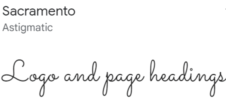

# Blossoming Bouquets

## Table of contents
* [UX](#ux)
    * [Strategy](#strategy)
        * [Project overview](#project-overview)
        * [Project goals](#project-goals)
    * [Scope](#scope)
        * [Consistent features implemented](#consistent-features-implemented)
        * [Unique features implemented](#unique-features-implemented)
        * [Features left to implement](#features-left-to-implement)
    * [Structure](#structure)
        * [Database model](#database-model)
        * [Applications](#applications)
    * [Skeleton](#skeleton)
        * [Wireframes](#wireframes)
    * [Surface](#surface)
        * [Colour scheme](#colour-scheme)
        * [Typography](#typography)
        * [Imagery](#imagery)
* [Testing](#testing)
    * [User story testing](#user-story-testing)
    * [Manual testing](#manual-testing)
    * [Automated testing](#automated-testing)
    * [Bugs and issues](#bugs-and-issues)
    * [Validator testing](#validator-testing)
* [Deployment](#deployment)
* [Credits](#credits)
    * [Technologies](#technologies)
    * [Resources](#resources)
    * [Content](#content)
    * [Media](#media)
    * [Acknowledgements](#acknowledgements)

# UX

## Strategy

### Project overview

[This project is...]

### Project goals

Below is a list of epics for this project which have been broken down into user stories. The implementation of these user stories have been planned and managed through the Github Kanban board tool. See the following link to the .

## Scope

### Consistent features implemented

There are a few features that have been purposely designed to look the same, to allow users to gain familiarity with the site layout and enable them to find information quickly. 

### Unique features implemented

### Features left to implement

Refer to the future improvements of [user story testing](#user-story-testing)

## Structure 

### Database model

Below is a link to the ERD created for this project.

### Applications

In this project, xxxx applications (apps) have been created; 

## Skeleton

### Wireframes

Below are links to the initial wireframes created for this project. During development, plans were slightly modified in order to improve the user experience. 

* [Home page](readme_documents/wireframes/home-page-wireframe.png)
* [Bouquets page](readme_documents/wireframes/bouquets-page-wireframe.png)
* [Blog page](readme_documents/wireframes/blog-page-wireframe.png)
* [Blog page expanded](readme_documents/wireframes/blog-expanded-page-wireframe.png)
* [Contact us page](readme_documents/wireframes/contact-us-page-wireframe.png)
* [Sign up page](readme_documents/wireframes/signup-page-wireframe.png)
* [Login page](readme_documents/wireframes/login-page-wireframe.png)
* [Basket page](readme_documents/wireframes/basket-page-wireframe.png)
* [Checkout page](readme_documents/wireframes/checkout-page-wireframe.png)

## Surface

### Colour scheme 

The colour scheme used in this site consist of colours; #666666 (grey), #db7093 (pink), #ffffff (white), #78866b (grey-green). These colours give a fresh yet minimalist look. 

### Typography 

There are two fonts used in this site which were sourced from [Google fonts](https://fonts.google.com/). Sacramento (cursive) has been used for the site logo and page headings and Montserrat (sans-serif) for the site body text. The combination of these two fonts give the site an elegant and minimalistic appearance.

| Image | Description |
| --- | --- |
|  | Logo and page heading font - Sacramento (cursive), Regular 400 |
|  | Body font - Montserrat (sans-serif), ExtraLight 200 |

### Imagery

The logo image has been created using a [Canva](https://www.canva.com/en_gb/) template. It was chosen to convey the purpose of the site; flower bouquets, in a minamalistic manner. The same image has been used to generate a favicon for the site, which was created using [Favicon.io](https://favicon.io/favicon-converter/)

The hero image and the bouquet images used for the site have been sourced from [Pexels](https://www.pexels.com/). 

The hero image was selected as it effectively portrays to the user the intent of the site and fits in well with the site colour scheme. The bouquet images selected, have all have been taken on a dark grey background (other than wedding bouquet images) and in the same pose, which adds a level of consistency to the site. 

Images were compressed using [Tiny png](https://tinypng.com/) in order to improve site load times for better user experience. 

[Font awesome](https://fontawesome.com/) icons have been used for navigation links (account, shopping bag, search), social media links (email and facebook) and key button links (keep shopping, checkout and view bag)

## Testing 

### User story testing 

Tests were performed to determine whether the user story acceptance criteria were met by the site development. 

### Manual testing 

Manual testing of interactive features was carried out, see tests and results of testing below:

### Automated testing 

Automated testing of the service model was also carried out using Django TestCase to test the service views, forms and model. 

### Responsive testing

The site works well on small, medium and larger screens. See below links to the responsive views on different screens. 

The features that respond to different screen sizes include:

### Bugs and issues

### Validator testing

W3 HTML Validator checks were carried out on the below pages, no errors found:

CSS W3 Validator checks were carried out on the style.css file - no errors found.

PEP8 checks were carried out on the below files, no errors were found:

Lighthouse testing also carried out to review site performance and useability, the results of these tests can be found below.

## Deployment 

A thorough walkthrough of the deployment steps taken for this project can be viewed in the below document. 

* [Deployment procedure](readme_documents/deployment/deployment_procedure.pdf)

## Credits

### Technologies 

The languages used for this project are: 

- HTML 
- CSS
- Javacript
- Python 

The frameworks, libraries, databases and programs used for this project are:

### Resources

The following sites were used to assist in this project:

### Content

The following sites were used to obtain information about flower shops:

* [Bunches](https://www.bunches.co.uk)
* [Blossoming gifts](https://www.blossominggifts.com)

### Media 

All images for this project were taken from the below sites:

* Logo - [Canva](https://www.canva.com/logos/)
* Hero image and bouquets - [Pexels](https://www.pexels.com/)
* Image coming soon - [Freepix](https://www.freepik.com)

### Acknowledgements

My heartfelt thanks extends to my husband for his continual support througout the entire course. I would like to offer my sincere thanks to my mentor Brian Macharia for all his time, advice and guidance throughout this project. My thanks also extends to the entire [Code Institute](https://codeinstitute.net/full-stack-software-development-diploma/?utm_term=code%20institute&utm_campaign=CI+-+UK+-+Search+-+Brand&utm_source=adwords&utm_medium=ppc&hsa_acc=8983321581&hsa_cam=1578649861&hsa_grp=62188641240&hsa_ad=581730217381&hsa_src=g&hsa_tgt=kwd-319867646331&hsa_kw=code%20institute&hsa_mt=e&hsa_net=adwords&hsa_ver=3&gclid=CjwKCAjw14uVBhBEEiwAaufYxzLItLILR2VKJH9mFRvzp_QbO7Gm2bbD9VZW_emQabtiDlH2qb665BoCvd0QAvD_BwE) Tutors who have been fantastic with helping out with troubleshooting issues. 

